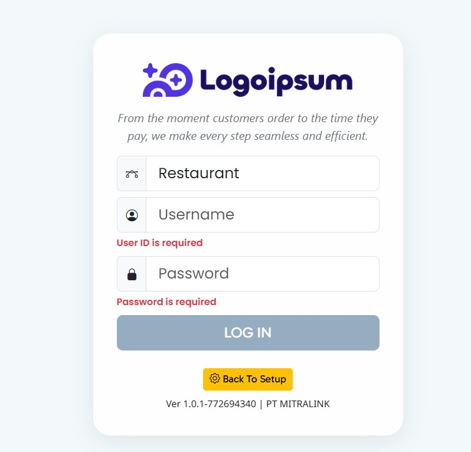
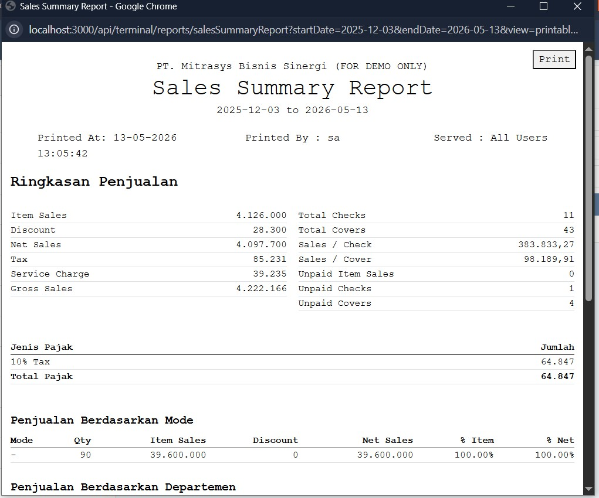

# FEATURE ADMIN POS ver 1.1

Dokumen ini adalah panduan singkat fitur admin untuk user operasional. Isinya dibuat seperti buku cerita pendek: lihat gambarnya, pahami tujuannya, lalu ikuti alur penggunaannya. Acuan menu mengikuti [Route Map](AGENT-ADMIN.md#2-route-map-frontend) di [AGENT-ADMIN.md](AGENT-ADMIN.md).

## Login Awal

Ini adalah halaman pertama yang muncul sebelum user masuk ke aplikasi. Dari sini user melakukan login atau menyiapkan koneksi awal jika diperlukan.

Gunanya untuk masuk ke sistem dan memulai sesi penggunaan. Setelah login berhasil, user bisa lanjut ke halaman utama dan membuka menu sesuai hak akses. Jika login belum berhasil, biasanya user perlu mengecek user name, password, dan koneksi server terlebih dahulu.

Langkah sederhana: buka halaman ini, isi data login, lalu tekan tombol login. Jika aplikasi menampilkan halaman utama, berarti sesi sudah aktif dan user siap memakai fitur lain.

## Daftar Isi

- [Login Awal](#login-awal)
- [Cara Membaca](#cara-membaca)
- [Ringkasan Alur Penggunaan](#ringkasan-alur-penggunaan)
- [Employee Management](#1-employee-management)
- [Daily Schedule & Holiday](#2-daily-schedule--holiday)
- [Payment Configuration](#3-payment-configuration)
- [Discount & Promotion](#4-discount--promotion)
- [Workstation](#10-workstation)
- [Outlet Management](#11-outlet-management)
- [Menu Configuration](#12-menu-configuration)
- [Modifiers](#13-modifiers)
- [Reports](#14-reports)
- [Table Map & Floor Plan](#15-table-map--floor-plan)
- [Cashback & UX Configuration](#16-cashback--ux-configuration)
- [Catatan Singkat](#catatan-singkat)

## Cara Membaca

1. Buka bagian modul yang ingin dipelajari.
2. Lihat gambar layar yang tersedia.
3. Baca penjelasan singkat di bawah gambar.
4. Ikuti alur dari atas ke bawah supaya mudah memahami urutan penggunaan.
5. Jika sebuah halaman tidak ada di sini, berarti belum ada screenshot atau fitur itu sudah tidak dipakai lagi di real case.

## Ringkasan Alur Penggunaan

Secara sederhana, alur penggunaan admin biasanya dimulai dari login, lalu user masuk ke menu utama, memilih modul yang dibutuhkan, dan mengubah data sesuai kebutuhan operasional. Setelah itu, user bisa berpindah ke modul lain tanpa harus keluar dari aplikasi.

Alur yang paling umum seperti ini:

1. Login ke sistem.
2. Buka menu sesuai kebutuhan.
3. Pilih halaman yang ingin dilihat atau diubah.
4. Cek data yang tampil di layar.
5. Tambah, ubah, atau simpan data bila diperlukan.
6. Pindah ke modul lain jika pekerjaan sudah selesai.

## 1. Employee Management

Bagian ini dipakai saat admin ingin mengurus data karyawan dan hak aksesnya. Gambarnya membantu Anda mengenali halaman yang harus dibuka.

Di sini user biasanya melihat daftar karyawan terlebih dahulu, lalu masuk ke detail jika ingin menambah atau mengubah data. Bagian level akses dipakai untuk membatasi menu yang bisa dibuka oleh masing-masing user.

### Halaman daftar karyawan

Route: `/employee`

Gunanya untuk melihat daftar karyawan, menambah data baru, dan mengubah data karyawan yang sudah ada.

Cara pakai singkat: cari nama karyawan pada daftar, buka data yang ingin diperbaiki, lalu simpan perubahan setelah selesai. Jika ada karyawan baru, biasanya admin menekan tombol tambah lalu mengisi data satu per satu.

### Halaman level akses

Route: `/employee/authLevel`

Gunanya untuk mengatur level atau peran akses karyawan.

Cara pakai singkat: tentukan peran yang cocok untuk user, misalnya admin, kasir, atau level lain yang dipakai di perusahaan. Setelah level dibuat, user bisa dipasangkan ke level tersebut supaya tampilan menu lebih sesuai kebutuhan.

### Halaman hak akses fitur

Route: `/employee/authLevel/accessRight`

Gunanya untuk menentukan fitur apa saja yang boleh dibuka oleh level tersebut.

Cara pakai singkat: pilih level akses yang ingin diatur, lalu tandai fitur yang boleh dipakai. Jika ingin membatasi user tertentu, cukup kurangi akses yang tidak perlu agar menu mereka lebih rapi dan aman.

## 2. Daily Schedule & Holiday

Bagian ini dipakai untuk mengatur jam operasional harian.

Halaman ini biasanya dipakai saat restoran punya jam buka yang berubah atau ada penyesuaian jadwal. Admin cukup melihat tanggal atau hari yang ditampilkan lalu menyesuaikan jam operasional sesuai kebutuhan.

### Halaman jam operasional

Route: `/dailySchedule`

Gunanya untuk mengatur jam buka dan jam tutup restoran.

Cara pakai singkat: cek hari yang ingin diubah, isi jam buka dan jam tutup, lalu simpan. Jika ada jadwal khusus di hari tertentu, pastikan isinya tidak bertabrakan dengan jadwal normal.

## 3. Payment Configuration

Bagian ini dipakai untuk mengatur cara pembayaran di sistem.

Pengaturan ini membantu user memilih jenis pembayaran yang nanti muncul di transaksi. Dengan data yang rapi, kasir lebih mudah memilih metode pembayaran yang sesuai saat proses penjualan.

### Jenis pembayaran

Route: `/payment/paymentType`

Gunanya untuk mengatur jenis pembayaran seperti cash atau card.

Cara pakai singkat: tambahkan jenis pembayaran yang memang digunakan di outlet, lalu beri nama yang mudah dipahami user kasir. Jika ada metode baru, biasanya ditambahkan dari sini sebelum dipakai di transaksi.

### Kelompok pembayaran

Route: `/payment/paymentGroup`

Gunanya untuk mengelompokkan jenis pembayaran.

Cara pakai singkat: gunakan kelompok ini untuk menyatukan beberapa metode pembayaran yang mirip agar pengaturan lebih mudah dibaca. Jika perusahaan punya banyak metode bayar, grouping membantu admin tidak bingung saat mencari data.

### Jenis uang cash

Route: `/payment/cashType`

Gunanya untuk mengatur pecahan atau jenis uang cash.

Cara pakai singkat: isi jenis uang sesuai pecahan yang dipakai di outlet. Tujuannya supaya data cash lebih tertata dan mudah dipakai saat penghitungan atau laporan.

### Jenis pajak

Route: `/payment/taxType`

Gunanya untuk mengatur jenis pajak dan tarifnya.

Cara pakai singkat: pilih jenis pajak yang dipakai, lalu isi nilai tarifnya dengan benar. Jika tarif berubah, admin cukup memperbarui data di halaman ini agar perhitungan berikutnya ikut sesuai.

## 4. Discount & Promotion

Bagian ini dipakai untuk mengatur promo dan diskon.

Di sini user dapat menyiapkan diskon yang sering dipakai di transaksi. Biasanya admin akan membuat kelompok diskon terlebih dahulu, lalu mengisi detail diskonnya agar mudah dipilih saat operasi.

### Kelompok diskon

Route: `/discount/discGroup`

Gunanya untuk mengelompokkan aturan diskon.

Cara pakai singkat: buat grup diskon sesuai kebutuhan, misalnya untuk promo tertentu atau kategori pelanggan tertentu. Setelah grup tersedia, admin bisa mengatur isi diskon dengan lebih terstruktur.

### Diskon utama

Route: `/discount`

Gunanya untuk mengatur diskon utama yang dipakai di sistem.

Cara pakai singkat: pilih jenis diskon yang ingin dipakai, isi nilai atau syaratnya, lalu simpan. Jika diskon sudah tidak berlaku, sebaiknya nonaktifkan atau ubah agar user tidak salah memilih.

## 10. Workstation

Bagian ini dipakai untuk mengatur perangkat kerja seperti printer dan terminal.

Bagian ini membantu admin memastikan perangkat kerja terhubung dengan benar. Biasanya dipakai saat menambah printer baru, mengganti terminal, atau menyesuaikan pembagian printer per area.

### Printer

Route: `/workStation/printer`

Gunanya untuk mengatur data printer.

Cara pakai singkat: pilih printer yang akan dipakai, pastikan nama dan koneksinya benar, lalu simpan pengaturannya. Jika printer tidak sesuai, hasil cetak bisa masuk ke perangkat yang salah.

### Kelompok printer

Route: `/workStation/printerGroup`

Gunanya untuk mengelompokkan printer.

Cara pakai singkat: gabungkan printer yang punya fungsi serupa ke dalam satu grup. Ini memudahkan saat sistem perlu menentukan printer mana yang dipakai untuk suatu jenis order atau area tertentu.

### Terminal POS

Route: `/workStation/terminal`

Gunanya untuk mendaftarkan terminal POS yang dipakai.

Cara pakai singkat: pastikan terminal yang dipakai di outlet sudah terdaftar di halaman ini. Data terminal yang benar akan membantu sistem mengenali perangkat yang sedang aktif.

## 11. Outlet Management

Bagian ini dipakai untuk mengatur data outlet atau cabang.

Halaman ini biasanya dibuka saat ada outlet baru, perubahan data cabang, atau penyesuaian detail outlet. Dari sini admin bisa melihat daftar outlet secara umum lalu masuk ke detail jika ingin mengubah informasi tertentu.

### Daftar outlet

Route: `/outlet`

Gunanya untuk melihat outlet yang terdaftar di sistem.

Cara pakai singkat: cari outlet yang ingin dilihat, buka barisnya, lalu cek informasi yang tampil. Jika ada data yang perlu diperbaiki, lanjut ke halaman detail outlet.

### Detail outlet

Route: detail outlet dari halaman outlet

Gunanya untuk melihat atau mengubah detail outlet.

Cara pakai singkat: buka detail outlet yang dipilih, cek nama, alamat, atau pengaturan lain yang diperlukan, lalu simpan jika ada perubahan. Halaman ini biasanya dipakai saat ada pembaruan informasi cabang.

## 12. Menu Configuration

Bagian ini dipakai untuk mengatur menu makanan dan struktur kategorinya.

Pengaturan menu membantu user menyusun item makanan dengan rapi, mulai dari nama item sampai struktur kategori yang dipakai saat order. Jika menu di outlet berubah, halaman ini biasanya menjadi tempat utama untuk pembaruan.

### Item menu

Route: `/menu/item`

Gunanya untuk mengatur data item menu.

Cara pakai singkat: pilih item yang ingin dibuat atau diubah, lalu isi nama, harga, dan data pendukung lain. Pastikan item yang tampil di menu sudah sesuai dengan daftar jual yang dipakai di outlet.

### Department menu

Route: `/menu/department`

Gunanya untuk mengatur department menu.

Cara pakai singkat: gunakan department untuk memisahkan kelompok menu, misalnya makanan, minuman, atau kategori kerja dapur tertentu. Dengan struktur ini, data menu lebih mudah dicari dan dikelola.

### Kategori menu

Route: `/menu/category`

Gunanya untuk mengatur kategori menu.

Cara pakai singkat: isi kategori yang sesuai dengan jenis makanan atau minuman, lalu simpan untuk dipakai di item menu. Kategori yang rapi akan membantu user saat mencari menu yang benar.

### Struktur menu

Route: `/menu/lookUp`

Gunanya untuk melihat struktur menu dalam bentuk tree.

Cara pakai singkat: buka tree menu untuk melihat susunan menu secara bertingkat. Tampilan ini membantu user memahami menu mana yang menjadi induk, cabang, atau item akhir.

### Tambah item ke struktur menu

Route: `/menu/lookUp`

Gunanya untuk menambahkan item ke dalam struktur menu.

Cara pakai singkat: pilih posisi menu yang tepat, lalu tambahkan item yang ingin dimasukkan. Setelah itu cek kembali apakah struktur tree sudah muncul sesuai urutan yang diinginkan.

## 13. Modifiers

Bagian ini dipakai untuk mengatur pilihan tambahan pada menu.

Modifiers biasanya dipakai untuk catatan tambahan atau pilihan rasa. User bisa menggunakannya saat order agar permintaan pelanggan seperti tanpa cabai atau tambahan tertentu tercatat dengan jelas.

### Modifier utama

Route: `/modifier`

Gunanya untuk mengatur modifier utama.

Cara pakai singkat: buat modifier yang sering dipakai pelanggan, lalu beri nama yang mudah dipahami oleh kasir dan dapur. Modifier yang baik akan mempercepat input order dan mengurangi salah catat.

### Kelompok modifier

Route: `/modifier/group`

Gunanya untuk mengelompokkan modifier.

Cara pakai singkat: masukkan modifier ke grup yang sesuai, misalnya untuk topping, tingkat pedas, atau catatan dapur. Dengan pengelompokan ini, user lebih mudah memilih opsi saat transaksi.

## 14. Reports

Bagian ini dipakai untuk melihat ringkasan transaksi, laporan penjualan, dan log aktivitas user. Biasanya halaman ini dibuka oleh admin yang ingin mengecek hasil transaksi atau mengevaluasi aktivitas operasional.

### Menu laporan

Route: `/report`

Gunanya untuk memilih jenis laporan yang ingin dibuka. Dari sini user bisa masuk ke laporan penjualan, transaksi, atau log user sesuai kebutuhan.

### Contoh laporan penjualan

Route: `/report/dailyClose`

Gunanya untuk melihat hasil laporan penjualan dalam bentuk ringkasan. Halaman ini membantu user membaca kondisi penjualan pada rentang tanggal tertentu.

### Daftar transaksi

Route: `/report/transaction`

Gunanya untuk melihat daftar transaksi yang sudah terjadi. Dari halaman ini user bisa mencari transaksi tertentu lalu membuka detailnya.

### Detail struk transaksi

Route: `/report/transaction/detail`

Gunanya untuk melihat isi transaksi lebih lengkap seperti struk, item yang dibeli, dan total pembayaran. Halaman ini cocok dipakai saat user ingin mengecek hasil transaksi secara detail.

### Log user

Route: `/report/userLogin`

Gunanya untuk melihat catatan aktivitas user di sistem. Halaman ini berguna saat admin ingin mengecek siapa yang melakukan tindakan tertentu dan kapan tindakan itu terjadi.

## 15. Table Map & Floor Plan

Bagian ini dipakai untuk mengatur meja dan tampilan denah ruangan.

Halaman ini sangat berguna saat user bekerja dengan denah meja. Dari sini admin bisa melihat meja mana yang aktif, menata layout, dan memastikan posisi meja mudah dikenali di layar operasional.

### Table map

Route: `/tableMap`

Gunanya untuk mengatur posisi dan data meja.

Cara pakai singkat: buka table map, lalu cek letak meja yang tampil di denah. Jika ada perubahan susunan meja di area restoran, halaman ini adalah tempat untuk menyesuaikannya.

### Icon atau template meja

Route: `/tableMap/template`

Gunanya untuk mengatur icon atau template meja.

Cara pakai singkat: pilih template yang sesuai dengan tampilan yang ingin dipakai di denah. Ikon yang konsisten akan membuat tampilan floor map lebih mudah dibaca user.

### Floor plan

Route: `/floorMap`

Gunanya untuk mengatur gambar dan layout floor plan.

Cara pakai singkat: unggah atau pilih gambar denah yang benar, lalu sesuaikan layout agar posisi meja sesuai dengan kondisi asli di lapangan. Jika layout rapi, user akan lebih cepat menemukan meja yang dimaksud.

## 16. Cashback & UX Configuration

Bagian ini dipakai untuk pengaturan cashback, tampilan tombol, dan bahasa.

Bagian ini membantu admin mengatur hal-hal kecil yang berpengaruh ke kenyamanan penggunaan. Cashback dipakai untuk promo, UX dipakai untuk tombol/fungsi, dan language dipakai untuk label tampilan.

### Cashback

Route: `/cashback`

Gunanya untuk mengatur program cashback.

Cara pakai singkat: tentukan program cashback yang sedang berlaku, lalu pastikan aturannya sesuai dengan promo yang ingin dijalankan. Setelah aktif, user bisa melihat program tersebut saat transaksi atau promo tertentu.

### Detail cashback

Route: `/cashback/detail`

Gunanya untuk melihat dan mengubah detail cashback.

Cara pakai singkat: buka detail cashback untuk mengecek nominal, periode, atau syarat yang dipakai. Jika ada promo baru, bagian ini biasanya diperbarui terlebih dahulu.

### UX

Route: `/ux`

Gunanya untuk mengatur fungsi atau tombol untuk user.

Cara pakai singkat: gunakan halaman ini untuk menyesuaikan tombol atau fungsi yang paling sering dipakai user. Dengan pengaturan yang pas, kerja operasional jadi lebih cepat dan tidak berantakan.

### Bahasa

Route: `/language`

Gunanya untuk mengatur bahasa atau label tampilan.

Cara pakai singkat: pilih label atau bahasa yang ingin ditampilkan, lalu simpan perubahan agar tampilan lebih mudah dipahami user. Ini penting jika ada istilah yang ingin dibuat lebih sederhana.

## Catatan Singkat

- Jika ada halaman yang tidak muncul di menu real case, berarti halaman tersebut legacy atau sudah tidak dipakai lagi.
- Jika nanti ada screenshot baru, bagian dokumen ini bisa ditambah tanpa mengubah format utama.
- Kalau ada screenshot report tambahan di kemudian hari, bagian Reports bisa diperluas dengan pola yang sama.
